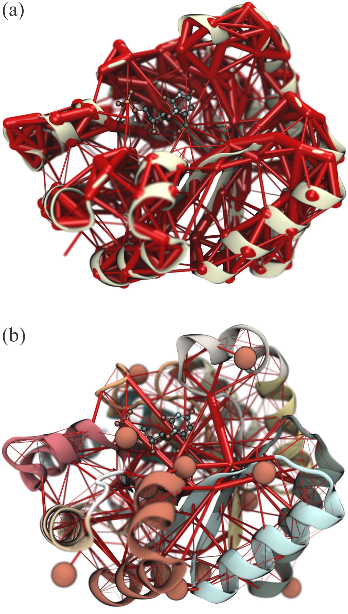

=============
Introduction
=============

Scientific Background
---------------------

In the last few decades molecular dynamics (MD) simulations have become an
indispensable tool for mechanistic analysis in structural biology. From its
first applications, revealing the fluid-like interior of protein that result from
the diffusional character of local atomic motion, to more recent applications
simulating entire organelles, the information content generated by MD studies
has grown rapidly. With the increase of system sizes and the frequent use of
enhanced sampling techniques, came the need for new and enhanced analysis tools,
capable of extracting information from massive amounts of data and
generating new insight.

Developed just over a decade ago, a particularly interesting technique that has
recently become popular is the analysis of dynamical networks. This technique has
been employed to study how groups of atoms interconnect in *communities*, and
also the allosteric signaling in tRNA:protein complexes, glutamine amidotransferase,
and many other systems.

The analysis of networks and their properties has a long history, with
applications in diverse fields such as engineering, and social networks,
and their approach to modelling molecular systems is particularly fruitful,
leading to a rich field of research. Using MD simulations to extract dynamical
features from biomolecules, from simple proteins to complexes, one can convert
the atomic representation of the system into a *nodes-and-edges* representation
that can then be analyzed much like any other graph. A key source of information
is the partitioning of the network in subgroups (or communities) using
algorithms such as Girvan-Newman's, providing information on cooperative motion
within a protein's subdomains, or on residues that mediate communication between
communities. Both are computationally challenging tasks, and can become very
expensive as the size of the network grows.

Dynamical Network Analysis
--------------------------

The approach take in Dynamical Network Analysis is one based on the correlation
of movement of representative atoms (or *nodes*), such as alpha-carbons of amino
acid residues. This serves as a measurement to determine the existence and
strength of a link between different atoms or molecules of a system.

Each node represents a set of atoms of a given residue, and there may be more
than one node per residue. By default, amino acid residues are represented by a
single node located in their alpha-carbons, and nucleotides by two nodes, one
in the backbone phosphate, and one in the nitrogenous base. Water molecules have
one node in their oxygen atom, and ions are trivially represented by one node.

The analysis performed here focuses solely on the correlation of movement of
nodes in close proximity. This way, only short-range *direct* interactions are
explicitly calculated, and long range interactions are determined through the
analysis of the network itself.

To determine which nodes are in contact, the shortest distance between heavy
atoms (all atoms excluding hydrogen atoms) represented by two nodes is
calculated. If the distance is shorter than 4.5 Angstroms in a simulation
frame, the pair of nodes is said to be in contact in that frame. If a pair of
nodes is in contact in more than 75% of a simulation, they are considered to be
in contact for the purposes of network analysis.

After determining all nodes in contact throughout a simulation, and calculating
the correlation of motion between them, the network can then be visualized
(see :ref:`Image 1 <FigNetwork>`).

.. _FigNetwork:

   Networks analysis of OMP-decarboxylase. (a) Full network revealing the most
   correlated regions of the enzyme. The weight of the network edges
   (represented by thickness of red tubes) is given by its normalized generalized
   correlation coefficient. (b) Rendering showing communities and betweenness
   values of edges of the OMP-decarboxylase dynamic network. Communities are
   delineated by the different colors of the protein secondary structure, while
   betweenness values of network edges are indicated by the thickness red tubes.
   Both images were rendered with VMD using the new Network Viewer 2.0 GUI.

Current Implementation
----------------------

This package was built to provide all functionalities necessary to the analysis
of MD simulations using the Dynamical Network Analysis method. In particular,
it accelerates the calcualtion of generalized correlation coefficients by first
calculating a contact matrix for the network, and then parallelizing the
correlation calculation only for the pairs of nodes in contact. This can save
over 99% of the computational cost of generalized correlation calculations.
